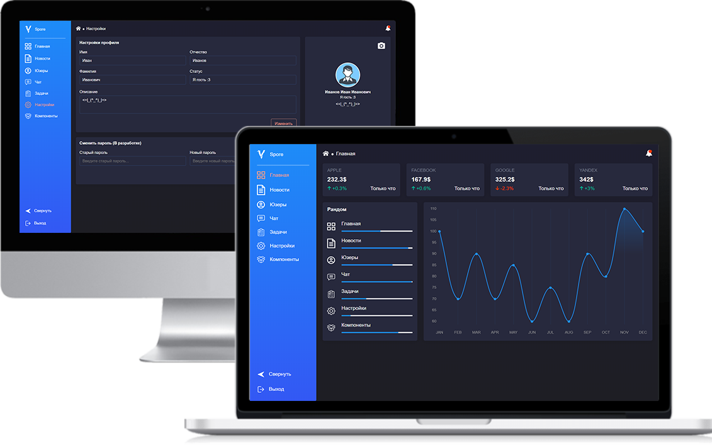

<a href="https://github.com/n-vasenkin">
    
</a>

Spore
======================

<p align="center">
  
</p>

# Содержание

* [Процесс разработки](#process)
* [Поддержка браузеров](#browser)
* [Staсk технологий](#stack)
* [Сборка проекта](#build)
* [Доступные команды](#command)
* [Структура проекта](#structure)
* [Адреса сервера](#servers)

<a name="process"></a>
### Процесс разработки
* ✅ — Вёрстка страниц
* ✅ — Разработка ui компонентов
* ✅ — Раразботка Бека 
* ✅ — Примеры макетов
* ⭕ —  Тестирование продукта
* ⭕ —  Сборка продукта
* ⭕ —  Публикация продукта

<a name="browser"></a>
### Поддержка браузеров
* Google Chrome (last 3 versions) 
* Not IE

<a name="stack"></a>
### Staсk технологий
* [TypeScript](https://www.typescriptlang.org) - язык программирования
* [React](https://reactjs.org) — библиотека для построения UI
* [MobX](https://mobx.js.org) — для реактивной работы с данными
* [Jest](https://jestjs.io/docs/en/getting-started.html) - тестирование проекта

<a name="build"></a>
### Сборка проекта
Сборка проекта происходит с помощью **[Webpack](https://webpack.js.org)**
Файл настроек: `./config/webpack.config.js`

<a name="command"></a>
### Доступные команды

##### `npm i`
Скрипт для начальной инициализации и установки зависимостей

##### `npm start`
Локальный запуск проекта по адресу **`localhost:3001`** в режиме разработки

##### `npm run build`
Сборка production-версии проекта. Результат сборки попадёт в папку `./build`

<a name="structure"></a>
### Структура проекта
```
app
├── config                      - файлы конфигурации проекта
├── public                      - публичные файлы, не требующие сборки
│   └── static                  - статичные файлы: документы, картинки и т.п.
├── src                         - основной каталог разработки
│   ├── __tests__               - тесты для компонентов и функций
│   ├── common                  - общие файлы, не касающиеся UI
│   ├── const                   - константы, используемые в проекте
│   ├── icons                   - svg иконки
│   ├── modals                  - модальные окна
│   ├── pages                   - компоненты страниц приложения
│   ├── routers                 - всё, что связано с навигацией по приложению
│   ├── stores                  - хранилище данных
│   ├── transport               - методы для обращения к серверу
│   ├── ui-kit                  - вспомогательные компоненты UI
│   ├── utils                   - мелкие утилиты и функции
│   ├── globalCss.css           - сброс глобальных стилей проекта
│   ├── index.ts                - точка входа в приложение
└── ...                         - файлы конфигурации, не попавшие в другие директории
```

<a name="servers"></a>
### Адреса сервера
* `http://cuddly-parakeet.herokuapp.com` — адрес боевого сервера